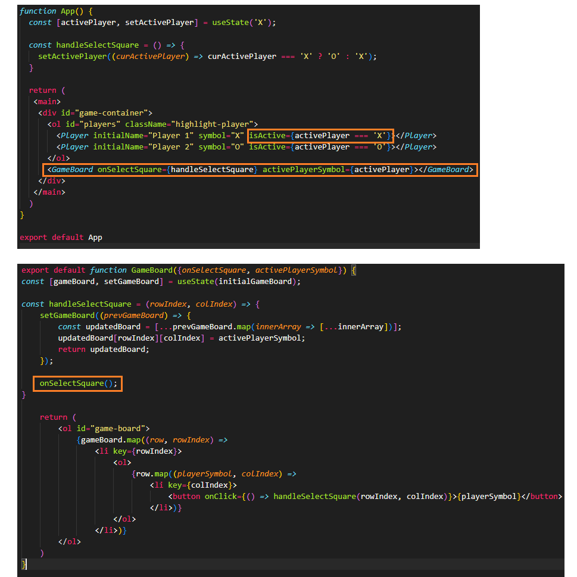

# Section 4: React Essentials: Deep Dive
### Fragments 
In JavaScript, we can't return two values by just wrapping them with parentheses and then splitting them across multiple lines. Its because of that why we need to wrap our components into one parent elements. Sometimes this element can be a div to set some props or styles, but when we don't need that we can just use Fragment (imported from React) and this would act like this parent element but without being render in the dom. We also can use `<></>`.

### Forwading props

As the props set on a custom component are not being forwaded unless we use them on the component itself, we need to receive always those props being set on the custom component. Sometimes we are going just to receive that value without any modification and that can be a little repetitive thing to do. Example:
~~~
    <Section title="Examples" id="examples" className="section">

We would need to receive those props in the component

    export default function Section({title, children, id, className}) {
    return (
        <section id={id} className={className}> 
            <h2>{title}</h2>
            {children}
        </section>
    )
}

This can be easy to do in the following way
export default function Section({title, children, ...props}) { // spreading any existing props
    return (
        <section {...props}>  // setting spread props in the element section
            <h2>{title}</h2>
            {children}
        </section>
    )
}
~~~

### Best Practice: updating state based on old state correctly
When is needed to update the state base on the previous value of the state, is not recommended doing it like this `setIsEditing(!isEditing);` because React is schedulling these state updates and both are based on the curren value of isEditing. 
Instead `setIsEditing((editing) => !editing)`, pass a function to the state updating function, because this function will automatically be called by React and will receive the guaranteed latest state value eventhough the change being rigth after a state change.

### Input and Two-way-binding
Listening to a change on the input and then feeding that updated value back into this input is called two-way binding, input has events listeners like onClick or onChange that returns and object where we can access for instance the value entered by a user on that input.

~~~
const handleChange = (event) => { 
    setPlayerName(event.target.value); // setting the state with the value of the event
}

<input type="text" required value={playerName} onChange={handleChange}></input> // using the state previouly set on the handleChange function
~~~

### Update object-state Inmutably
If we have in our state an object or an array is recommended to update that state in an immutable way, wich siply means create a copy of the old state, so a new object or a new array first and then change that copy instead of the existing object or array. And the reason is that if we have objects or arrays we are dealing with a reference value in JavaScript and therefore if we just update that object we would be updating the old value in-memory inmediately, and this could lead to bugs or side effects.
~~~
const updatedUser = user; // NOT creating a copy
user.name = 'Paula' // editing the user object in memory

const updatedUser = {...user} // creating a copy via JavaScript's spread operator
updatedUser.name ? 'Paula' // Editing the copy
~~~

### Lift the state up
Means lift the state up to the closest ancestor component that has access to all components that need to work with that state. For example, Player and GameBoard component both need to know about who player is active, Player component just to set an active class and GameBoard to show the proper symbol. So we handle of this in App component and pass the value via props. 

