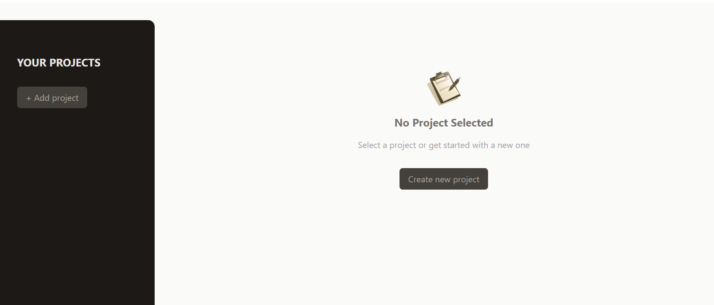
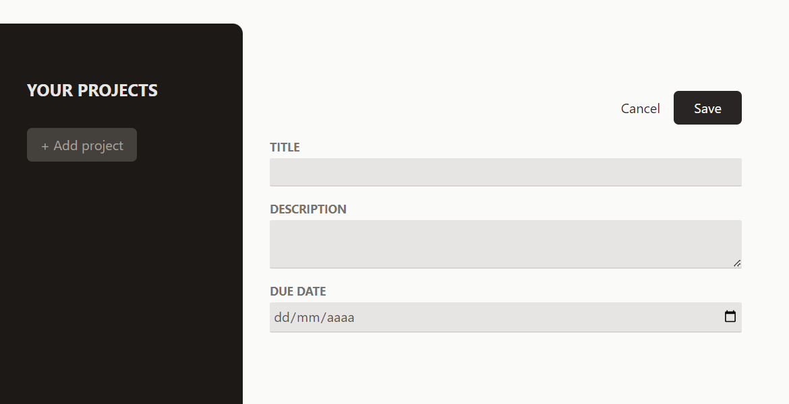
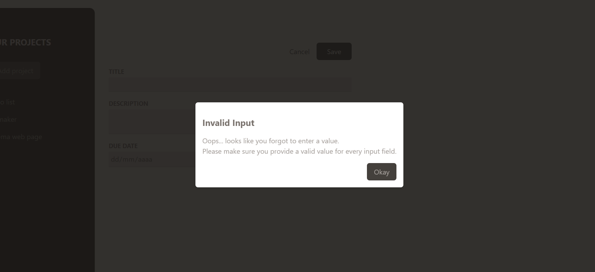
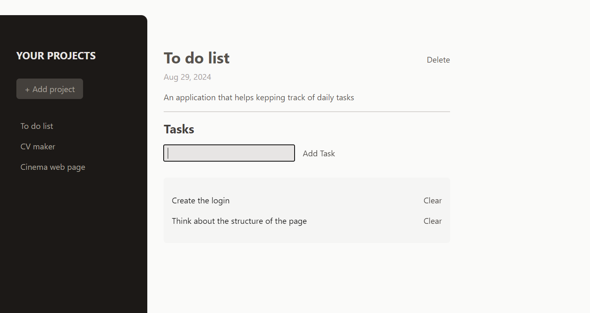

# Section 9: Practice project
In this section the idea was to implement the previous topics learned, such as React essentials like components, props, state, ref, forwardRef, portals, methologies like lifting the state up, prop drilling and stylish with tailwind. 
### Project Objetive:
The application helps adding projects listing them on a sidebar with the posibility of adding tasks in each project. The landing shows a sidebar, with a title "Your Projects" and a button "Add new project" to the left and to the rigth shows at first an image with a text that says "No projects selected" and a button to create a new project that then will be added to the list on the sidebar.

### Actions: 
**-Clicking on create new project:** the image and texts that were shown at first are hidden and a form is visible with a title, a description a calendar to pick a due date inputs, here we have a cancel button that lead as to first screen and a save button that moves this new project to the list in the sidebar.

If the user tries to save any input with empty data a modal is shown with a warning of Invalid Input

**-Clicking on an item of the list:** shows the title, date and description of the project as well as an input to enter as many tasks as the user desire, a delete button is available next to the title of the selected project to remove it of the list. When adding a task a clear button is available to delete a task. 

### Project structure: 
**- App.js:** In this component first of all we are using useState React hook to store an object with the selectedProjectId, an array of projects and another of tasks.
There are functions to handle adding and deletion of projects and tasks with the help of spread operator.
In this component we are rendering the ProjectSidebar and conditionaly the NewProject and NoProjectSelected component. \
**- ProjectsSidebar.jsx:** This component is in charge of rendering the list of projects and a button to add a new one. 
The components uses 4 props that are forwarded for the App component:
    - onStartAddProject: this is used on the onClick prop of the Button custom component, this is a pointer to the ***function handleStartAddProject()*** inside of App that handle the addition of new projects
    - projects: brings the list of current projects
    - onSelectedProject: is used on the project item of the list passing in the id and to make it clickeable
    - selectedProjectId: first key of our state object, to conditionally set the proper classes to the button
**- SelectedProject.jsx:** it handle the rendering of the project selected title, description, the delete project button as well as the Tasks component that shows the tasks added to the project selected. This component accepts 5 props:
    - project: this points to the selectedProject constant in the App component that utilizes the find() javascript method to get the item that is being selected
    - onDelete: points at ***function handleDeleteProject()*** on the App component that handle the deletion of the selected project by using the filter() javascript method that receive every item as an input and returns true if we want to keep the item and false if we want to drop it. This is hanlde comparing the previous item selected with the current, if is different im returning false so the filter() method will drop the item.
    - onAddTask: prop drilling from App to Tasks component
    - onDeleteTask: prop drilling from App to Tasks component
    - tasks: prop drilling from App to Tasks component \
**- NewProject.jsx:** shows a Modal if any input is empty when try to save and 3 inputs to add the title, descriptio and due date of the project.
This component receives 2 props: 
    - onAdd: this lift the sate up, meaning that this prop is sending the new object with updated information to the App component, this is handle via the ***function handleSave()*** (created in this component) that uses de ref values of title, description and dueDate to populate an object with the keys that needs the state on App component. Then on the Save button ***handleSave()*** is used on the onClick prop pointing at the ***function handleAddProject(projectData)*** in the App component that is in charge of adding the new project to the existing projects list via the projectData parameter populated in this component.
    - onCancel: is used on the onClick prop of the Cancel button poiting at the ***function handleCancelAddProject()*** that sets the selectedProjectId to undefined. \
**- NoProjectSelected.jsx:** is what we see the first time we enter to the page, this custom component renders the image, title, paragraph and button "Create new project". It accepts  prop
    - onStartAddProject: to lead the user to the project form page, in order to add it to the list. This prop is used on the onClick Button (custom) component. \
**- Tasks:** is in charge of rendering the detail of the selected project and show an input to add a task for the current project, also has buttons to delete the selected project or the any task that the project has. This component receives 3 props:
    - tasks: this brings from App through SelectedProject component the tasks that has a certain project, this is used to render conditionally a mesagge if no tasks have been added or to show a list with tasks added.
    - onAdd: this comes from App, then SelectedProject, through Tasks and passed to NewTask custom component.
    - onDelete: comes from App through SelectedProject to here to pass the id on the onClick Button (custom) component to be utilized in  ***function handleDeleteTask(id)*** on App.jsx \
**- NewTask:** this components handles the addtion of a new task to the list of tasks in the selected project. This is done through the use of useState hooks that handles the change of the input finalizing on the addition of the current value to the state. This component uses 1 prop:
    - onAdd: this prop lift the input state up to the App component where the new text entered by the user is used as a parameter of the ***function handleAddTask(text)*** \
**- Modal.jsx:** this component is in charge of rendering a modal when the user entered wrong information on the creation of a new project, the modal receives 2 props:
    - children: to bring anything inside of Modal component where is used
    - buttonCaption: to be used on the Button (custom) component in order to make this modal reusable
The Modal component uses forwardRef, useImperativeHandle, useRef and createPortal in order to use the showModal method and to move the Modal up to a div with 'modal-root and not in the middle of the page structure.