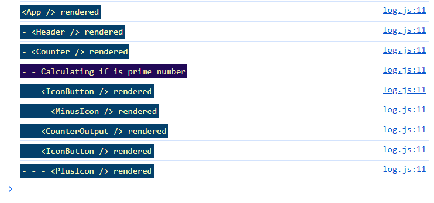
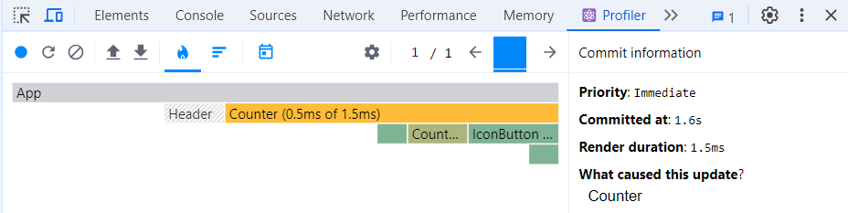

# Section 13: A look behind the scenes of react & optimization techniques

### How does React update the DOM?
**How are components functions executed?** \
Rendering a component means that React goes ahead an execute a component's function and return a jsx code wich is translated to javascript code and then translated to actual elements that can be render on the screen.
React renders step by step the built in components such as h2, p, div tags as well as custom components, when encouter a custom component goes to that component and render what is inside, then 'come back' and keep rendering the next elements in order to build the component tree.

~~~
function App() { // 1. executes this function component
  log('<App /> rendered');

  const [enteredNumber, setEnteredNumber] = useState(0);
  const [chosenCount, setChosenCount] = useState(0);

  function handleChange(event) { // 2. creates this functions not executed
    setEnteredNumber(+event.target.value);
  }

  function handleSetClick() {
    setChosenCount(enteredNumber);
    setEnteredNumber(0);
  }

  return ( // 3. return jsx code
    <>
      <Header /> // 4. goes to Header component a render what is inside
      <main> // 5. keeps rendering next elements
        <section id="configure-counter"> 
          <h2>Set Counter</h2>
          <input type="number" onChange={handleChange} value={enteredNumber} />
          <button onClick={handleSetClick}>Set</button>
        </section>
        <Counter initialCount={chosenCount} /> // 6. Renders what inside here, more custom components
      </main>
    </>
  );
}

export default App;
~~~

With the React profiler devtools we can record a session a see how react rendered the component tree and also see wich component triggered it.

### memo() // is wrapped around components functions
There are moments where we trigger re rendering of several components just because we update one component for having a state that gets updated leading to the execution of all the component on the family tree, that doesn't mean that impacts on the actual DOM because how React works, but that can be optimazed.
**memo() compares prop values,** if the prop values are equal the component function will not be executed again, but if they are different the component will execute again.
~~~
import { memo } from 'react';

const SomeComponent = memo(function SomeComponent(props) {
  // ...
});
export default SomeComponent;
~~~

***DON'T OVERUSE MEMO():***
- Use it as high up in the component tree as possible, blocking a component execution there will also block all child components executions.
- Cheching props with memo() costs performance, don't wrap it around all your component, it will just add a lot of unnecessary chekcs.
- Don't use it on component where props will change frequently, memo() would just perform a meaningles check in such cases (wich costs performance)

### useMemo() // wraped around normal functions that are executed in component functions to prevent their execution

This hook should only be used when you complex calculations that you want to prevent; useMemo takes to parameter the first a function that you want to store, and the second an array of dependecies to know when to reexecute the function `useMemo(() => { function(arg, arg2)}, [dependency1, dependecy2])`
~~~
const initialCountIsPrime = useMemo(() => isPrime(initialCount), []);
~~~

### Why keys matter when managing state
The same custom component can be re used multiple times and pass different values to prop, react will render the same component but is not going to affect to the others even though they are the same component. However if we are managing state in the component we need to know that state is tracked by position by React
