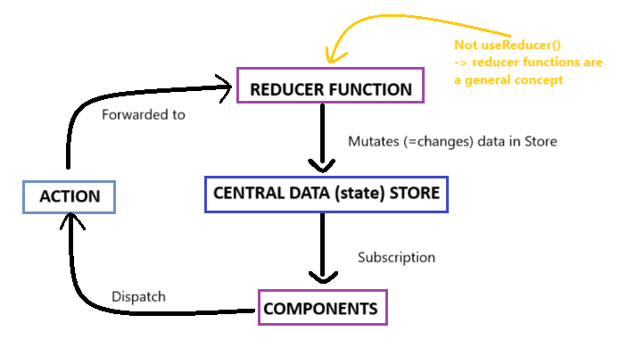

# Section 19: Diving into Redux (an alternative of context API)
### What is Redux?
Is a state management system for cross-component or app-wide state.
It helps us manage state, data that changes and affects our application and what we display on the screen. It helps us manage such data across multiple components or even the complete app.
Different types of state:
- Local State: state belongs to a single component. Example: listening to user input on an input field or toggling a "show more details" field. **Should be managed inside the component via useState() / useReducer()**
- Cross-component State: staate affecting multiple components. Example: open / closed state of a modal overlay. **Should be managed inside the component via useState() / useReducer(), required "prop drilling"**
- App-wide State: state affecting the entire app. Example: use authentication status or chose theme. **Requires prop drilling or React Context or Redux**

### Disadvatages of React Context
- Complex setup & managment: in more complex apps, using React Context can lead to deeply nested or "fat context provide" components
- Performance: React Context is not optimized for high-frequency state changes

### How Redux Work
***Redux is all about having one Central Data (state) Store, in your application.***
1. You have exactly ONE store for all your state for yout entire application. Here you could have authentication, theming, user input state, etc.
2. Components uses the data in the sotre via subscritions. Whenever the data changes, the store notifies components, and then components can get the data they need. **Components NEVER directly manipulate the store data**
3. Components triggers or **dispatch ACTIONS**. An action is just a simple JavaScript object, wich describes the kind of operation, the reducer should perform.
4. Redux forwards actions to the reducer, reads that description of the desired operation, and then this operation is performed by the reducer. 
5. For mutate or update the data we use a **Reducer Function** wich takes some input, and then transfor that input, they reduce it and show the new value.

### Creating our Central Data Store

We create a file that will be handling the state, importing the createStore method and setting it returned value to a constant called store, then we create a reducer function that is going to be managing the different actions.  
~~~
import { createStore }  from 'redux';

const counterReducer = (state = { counter: 0 }, action) => {
    if (action.type === 'increment') {
        return {
            counter: state.counter + 1
        }
    }

    if (action.type === 'decrement') {
        return {
            counter: state.counter - 1
        }
    }
    return state;
}

const store = createStore(counterReducer);

export default store;
~~~
At the top level of the App we wrap the app with the Provider component from 'react-redux' and pass as a value our exported store previously created.
~~~
import { Provider } from 'react-redux';
import store from './store/index.js';

const root = ReactDOM.createRoot(document.getElementById('root'));
root.render(<Provider store={store}><App /></Provider>);
~~~

### Using Redux data in components and dispatching action to mutate the state
There is a redux the useSelector() hook that allow us to get the piece of state we need, using this hook React Redux will automatically set up a subscription to the Redux store for this component. So your component will be updated and will receive the latest counter automatically whenever that data changes in the Redux store. So it's an automatically reactive and changes to the Redux store will cause this component function to be re executed.
With the help of useDispatch() we can trigger an action by passing the type property with the value we need to triger certain actioN:
~~~
import { useSelector, useDispatch } from 'react-redux';
import classes from './Counter.module.css';

const Counter = () => {
  const dispatch = useDispatch();
  const counter = useSelector(state => state.counter);

  const incrementHandler = () => {
    dispatch({ type: 'increment'}) // dispatching the increment action
  }

  const decrementHandler = () => {
    dispatch({ type: 'decrement'}) // dispatching the decrement action
  }

  const toggleCounterHandler = () => {};

  return (
    <main className={classes.counter}>
      <h1>Redux Counter</h1>
      
{counter}
 // using the state value
      

        <button onClick={incrementHandler}>Increment</button> // onClick listener, triggers dispatch 
        <button onClick={decrementHandler}>Decrement</button> // onClick listener, triggers dispatch 
      

      <button onClick={toggleCounterHandler}>Toggle Counter</button>
    </main>
  );
};

export default Counter;
~~~

### Attaching payloads to actions
The action received in the reducer function doesn't have only a type property, it has also a payload property (that name can be set by us) that allow us to pass a value to the dispatch action.
**Counter.js** 
~~~
const increaseHandler = () => {
    dispatch({ type: 'increase', amount: 5 })
}
~~~
**index.js** - Store
~~~
if (action.type === 'increase') {
    return {
        counter: state.counter + action.amount
    }
}
~~~

If we want to add another piece of state to our store we jsut need to add it like this: 
~~~
import { createStore } from "redux";

const initialState = { counter: 0, showCounter: true }; // we have two different states

const counterReducer = (state = initialState, action) => {
  if (action.type === "increment") {
    return {
      counter: state.counter + 1, // using the first piece of state
      showCounter: state.showCounter // need to add or will be override
    };
  }

  if (action.type === "increase") {
    // ...
  }

  if (action.type === "decrement") {
    // ...
  }

  if (action.type === "toggle") {
    return {
        showCounter: !state.showCounter, // using the second piece of state
        counter: state.counter // need to add or will be override
    }
  }
  
  return state;
};

const store = createStore(counterReducer);

export default store;
~~~

> you must never mutate state the original state which you're getting. `state.counter++` This can lead to bugs, unpredictable behavior and it can make debugging your application harder as well. **Always return a brand new object where you copy any nested objects or erase.** Like this: 
~~~
return {
    counter: state.counter + 1,
    showCounter: state.showCounter
};
~~~ 

### Redux Toolkit
With the help od useSlice() we can prepare a slice of our global state. For example when we have different pieces of state which are not directly related, let's say an authentication status and the counter status, we could create different slices potentially also in different files to make our code maintainable.
The slice created is an object with a name property, an initial state and a reducers property that holds different methods wich receives the current state. This methos will automatically be called by us depending on wich action was triggered, so we don't need to write our own if checks anymore. In this method **we are allow to mutate the state** because when using Redux toolkit and its functions like create slice, we can't accidentally manipulate the existing state. Because Redux toolkit internally uses another package, called imgur, which will detect code like this and which will automatically clone the existing state, create a new state object, keep all the state which we're not editing, and override the state which we are editing in an immutable way.
~~~
import { createSlice } from "@reduxjs/toolkit";

const initialState = { counter: 0, showCounter: true };

createSlice({
    name: 'counter',
    initialState: initialState, 
    reducers: {
        increment(state) {
            state.counter++
        },
        decrement(state) {
            state.counter--
        },
        increase(state, action) {
            state.counter = state.counter + action.amount
        },
        toggleCounter(state) {
            state.showCounter = !state.showCounter
        }
    }
});
~~~

### Using the store
~~~
const counterSlice = createSlice({
    ...
})

const store = configureStore({
    reducer: counterSlice.reducer
});
export default store;
~~~

### How to use the different methods on the components
We can asing the methods (actions) created with counterSlice on a constant and use them on the components like this `export const counterActions = counterSlice.actions;`. Actions has a default payload prop to access any value we need. 
To use them in a compent we do the following:
~~~
const incrementHandler = () => {
    dispatch(counterActions.increment())
}

const increaseHandler = () => {
    dispatch(counterActions.increase(5))
}

const decrementHandler = () => {
    dispatch(counterActions.decrement())
}

const toggleCounterHandler = () => {
    dispatch(counterActions.toggleCounter())
};
~~~

### Adding a new state to the store
When we need to add another functionalities we need to create another slice, in order to concerns be apart. In this case we create a new slice for the authentication state:
~~~
const initialAuthState = {
    isAuthenticated: false
}

const authSlice = createSlice({
    name: 'authentication',
    initialState: initialAuthState,
    reducers: {
        login(state) {
            state.isAuthenticated = true
        },
        logout(state) {
            state.isAuthenticated = false
        }
    }
})
~~~
As we have one and only one store we export them in an object with key values pointing to the differents slices. 

Changing this:
~~~
const store = configureStore({
    reducer: counterSlice.reducer
});

export const counterActions = counterSlice.actions;
export default store;
~~~

To this:
~~~
const store = configureStore({
    reducer: { counter: counterSlice.reducer, auth: authSlice.reducer }
});

export const counterActions = counterSlice.actions;
export const authActions = authSlice.actions;

export default store;
~~~

Then to use this slices we need to use point notation. 
~~~
const counter = useSelector(state => state.counter.counter);
const show = useSelector(state => state.counter.showCounter);
~~~