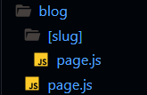

# Next.Js
Is a React framework that allow us to build fullstack applications.

### Understanding file-based routing and react server components
NextJs uses files and folders to define routes, so only files and folders inside the "app" folder are considered.
Inside a Nextjs project we have reserved filename such as:
- page.js: Define page content 
- layout.js: Define wrapper around pages
- not-found.js: Define "Not Found" fallback page
- error.js: Define "Error" fallback page

**app.js** Where we set our different pages   
**page.js** Should render a page

### ***React Server Components*** (Rendered only on the server NEVER on the client)
Are components which requires a special "environment", NextJs provides such an environment. 
SERVER-SIDE (backend) => Page/HTML content is rendered on the server & sent to the client => CLIENT-SIDE (frontend)

### Navigating between pages
Instead of using an anchor element we need to use the special element Link from  `import Link from "next/Link";`

If we set a new page with an anchor element we will be creating a flaw. It's not ideal, and you we see that there is a flaw if we take a look at the refresh icon up in the left corner, as we click About Us, we will see that it briefly turns to a cross, which always is a sign that a brand new page was downloaded from the backend. 
The disadvantage with that is that we no longer have a single page application, as we normally do when working with React. 
What is great about NextJs is that when we visit a page for the first time by, for example, manually entering the URL, then indeed it's rendered on the server, we get the finished page. But if we are on a page and we then navigate around by clicking links, for example, Nextjs allows us to actually stay in a single-page application and update the UI with help of client-sie Javascript code. Now, technically the content of the Next page will be pre-rendered on the server, but it will then be updated on the client side, and therefor we can get the best of both worlds.

## IMPORTANT: the reserved file name are only reserved when creating them inside of the app/ folder ( or any subfolder ). Outside of the app/ folder, these filenames are not trated in any special way.
1. page.js: Create a new page ( app/about/page.js creates a <my-domain>/about page)
2. layout.js: Create a new layout that wraps sibling and nested pages
3. not-found.js: Fallback page "Not Found" error (thrown by sibling or nested pages or layouts)
4. error.js: Fallback page for other errors (thrown by sibling pages or nested pages or layouts)
5. loadin.js: Fallback page which is shown whilst sibling or nested pages (or layouts) are fetching data.
6. route.js: Allows us to create an API route (a page which does not return jsx code but instead data, in the JSON format)

### Working with Pages & Layouts
**layout.js** is another reserved file name, where the **page.js** file difines the content of a page, the **layout.js** file defines the shell around one or more pages. It's the, as the name implies, layout, into which a page will be rendered. And every next project needs at least one root **layout.js** file. 
This is the basic squeleton of layout.js
~~~
export default function RootLayout({ children }) {
  return (
    <html lang="en">
      <body>{children}</body> // children is the content of the page
    </html>
  );
}
~~~

### global.css file is also a reserve name file
And its imported in the layout.js file so that it's essentially available on every page that's being loaded.

### icon.png is another reserved file name
If we add an incon.png it will be used as a favicon.

`import Header from "@/components/header";` the @ is the root folder, we can just use the common '..' or @

### Configuring dynamic routes & using route parameters
A dynamic route is a route which we only define once, but which is then capable of rendering different pages for different blog posts. In next.js we can create such a dynamic route by adding a nested folder where we should use square brackets.
This square brakets simply tells Nextjs that we want to have some path segment after blog in this case, but that we don't know the exact value of the segment yet. And it's then this placeholder, this identifier **slug** that will give us access to the concrete value that we do get when the route is loaded.

