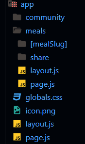

# NEXT.JS FOOD PROJECT

### Revisiting the concept of layouts

The idea behind layouts in NextJs is that they act as wrappers around pages. And we theoretically also have nested layouts where a subset of pages could also use another more specialized layout.
So if we had a lyout in the meals folder, then that layout would indeed become active for those meals-related pages, but it would itself be nested into the root layout. So the root layout will always be active.

### Importing images 
In Next projects, unlike many other React projects, we can't just assign an image like this: 
~~~
import logoImg from "@/assets/logo.png";

 
~~~
Instead, we need to access the SRC property because this imported logo in Next projects will be an object where the apth to the image is the stored under that SRC property. 
~~~
import logoImg from "@/assets/logo.png";

 
~~~

### Styling NextJs Projects: Our options & CSS Modules
- Option 1: Global.css file, we could add multiple global CSS files. They are global because they're getting imported like this `'./global.css' in the **layout.js** file in the **rootLayout.js** file. And therefor any CSS file that's being imported like this into the **rootLayout.js** file will be available on every page.
- Option 2: Tailwind.css (a popular solution). A library to allows us to style elements by adding small utility classes to those elements. 
- Option 3: CSS Modules. Files that end with ***.module.css*** and then we can import an object from those files, wchich will be generated automatically by the underlying build process and development server, which gives us access to all the CSS classes defined in those files as properties.

### Optimazing images with the built-in Nextjs Image component
This special built-in image component exists to help us outputting images in a more optimized way. For example, by lazy loading images under the hood so that they're only displayed if they're really visible on the page. This image componots has also a lot of props we can use.
`<Image src={logoImg} alt="A plate with food on it" />`
If we don't need lazy loading and we want to tell the NextJs and the browser that this image should always be loaded as quickly as possible to make sure that we got no unnecessary content shift or flickering when the page loads, we can use the ***priority*** property to make sure that this is loaded with priority
`<Image src={logoImg} alt="A plate with food on it" priority />`

## React Server Components vs Client Components

In the typical React project created with vite we are using ***client components*** out of the box. Because in those projects, React.js is a pure client side library, running code in the browser on the client.
With Nextjs, that changes because NextJs is a fullstack framework. It has a backend, not just frontend, and therefore code also executes on that backend when working with NextJs. 
By default, all those React components we have in out Nextjs project, no matter if they're pages, layouts or standard components are only rendered on the Server. **That's why thery're called React Server Components.**
So for example if we console.log a word in a functional component, we would see that word on the terminal where we started our server and no in the browser console. 

#### With Server Components we have less client side JavaScript code that must be downloaded, hence possibly improving the performance of our wbsite. And it's also great for searh engine optimization, because web search crawlers now see pages that contain the complete finished content

Nonetheless, in NextJs projects, we can still also build client components, and that would be components that are still technically pre-rendered on the server, but then also potentially rendered on the client. ***And more importanttly, these are components that must be rendered on the client because they contain some code or use some features that are only available on the client, for instance react hooks.***
To tell NextJs to build a client component we need to use a special directive at the top of the file that holds the component. We need to use client directive, and that then allows us to use client site features in our components, like event handler or hooks like useEffect or useState
~~~
"use client"; // CLIENT DIRECTIVE

import { useEffect, useState } from "react";
import Image from "next/image";
~~~