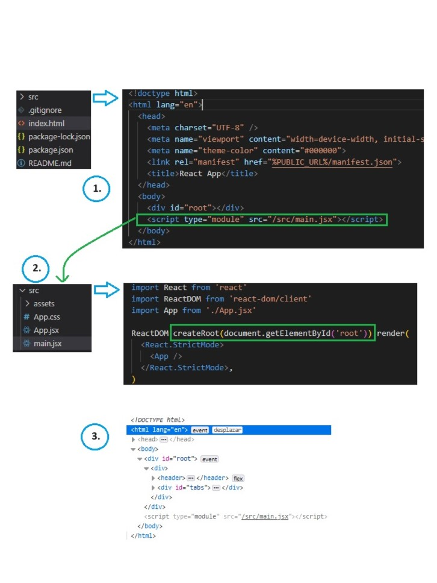

# Section 3: React Essentials, components, JSX, props, state & more.
## Components: 
React Apps are built by combining components, diffferents user interfaces are built by the combination of different components; this are not unique or exclusive to React. 
Any website or app can be broken dowwn into smaller building blocks: ***Components.*** The idea behind those Components is that they wrap HTML, CSS and JavaScript logic that mith be needed and toghether those languages and code pieces define and control a part of the UI, that allows the developer to split up complex user interfaces into smaller and manageable parts wich may also be use in another parts of the app. 
- Reusable Building Blocks: create small building block & compose the UI from them, if needed reuse a building block in different parts of the UI.
- Related HTML & JS (and posibly CSS) code is stored together. 
- Separation of Concerns: different components handle different data & logic, simplifying the process of working on complex apps.

### JSX (**J**avascript **S**yntax e**X**tension)
Used to describe & create HTML elements in JavaScript in a declarative way. And this extension allows developers to describe and create HTML elements by writing HTML markup code inside of JavaScript files.

### Component Functions Must Follow Two Rules
1. Name starts with uppercase character, multi-word name should be written in PascalCode(e.g. "MyHeader") and its recommended to pick a name that describes the UI building block (e.g "Header").
2. Returns "renderable" content, that means returning a value that can be rendered ("displayed on sreen") by React

~~~
function Header() { // Components are functions
  return (
    <header>
        
        <h1>React Essentials</h1>
        

          Fundamental React concepts you will need for almost any app you are
          going to build!
        

      </header>
  )
}

function App() {
  return (
    

      <Header /> // used as HTML tags
      <main>
        <h2>Time to get started!</h2>
      </main>
    

  );
}

export default App;
~~~

### How React handles components & how it builds a "Component tree"

1. index.html its beeing serve to the browser. This file is importing an script "main.jx".
2. main.jsx acts as the main entry point of the React app, since is the first file to be loaded by the HTML file. This files is importing ReactDom library wich is rendering the App component by passing the App component as a value to the render() method, then the createRoot() method is getting the "root" element from the index.html and injecting the App component.
3. If we inspect the browser we can see that DOM tree is being structure in the correct way even though we have this elements on different files, also our components are being showed as common html tags.

### Outputting dynamic content in JSX
- Static content: content that's hardcoded into the JSX code, can't change ar runtime. Example: `<h1>Hello World!</h1>`
- Dynamic content: logic that produces the actual values is added to JSX, content/value is derived at runtime. Example: `<h1>{userName}</h1>`

### Reusing component through Props
React allows you to ***pass data to component*** via concept called props.

~~~
export default function CoreConcept({image, title, description}) { // COMPONENT WITH PROPS DESTRUCTURED
    return (
      <li>
        </img>
        <h3>{title}</h3>
        
{description}

      </li>
    )
}

<CoreConcept  // USING THE COMPONENT AND PASSING OBJECT VALUES TO PROPS
    title={CORE_CONCEPTS[0].title}  
    description={CORE_CONCEPTS[0].description}  
    image={CORE_CONCEPTS[0].image}
/>
~~~

- **The special "children" Prop**

This is a prop that's set by React and it's a prop that's not set with help of attributes, so the children prop contains whichever content you have between your component, and that can simply be some text or be some complex JSX structure instead if needed.
~~~
export default function TabButton(props) {
    return (
        <li><button>{props.children}</button></li>
    )
}

<TabButton>Components</TabButton> 
~~~

### How React updates the UI
React will only execute a Component function once when it's first encountered somewhere in the code. We need a way of telling React that we want to update the UI, this can be achieved with another crucial React concept called state. 
This concept is all about registering variables, you could say, that are handled by React 
and that are updated with help of a function that's provided by React, that will also tell React that data changed and that will therefore cause React to update the UI.
~~~
import {useState} from 'react' // function (react Hook) from React library to update the UI
~~~
- Rules of Hooks: 
    1. Only call Hooks inside of Component Functions.
    ~~~
        function App() {  // THIS IS CORRECT
            const [val, setVal] = useState(0);  
        }
        
        const [val, setVal] = useState(0);  // THIS IS WRONG
        function App() { 
        }

    ~~~
    2. Only call Hooks on the top level
     ~~~
        function App() {  // THIS IS CORRECT
            const [val, setVal] = useState(0);  
        }
        
        function App() {  // THIS IS WRONG
            if (someCondition) {
                const [val, setVal] = useState(0);  
            }
        }
    ~~~
### Rendering content conditionally based on state
~~~
const [selectedTopic, setSelectedTopic] = useState();
-----------------------------------------------------
    {!selectedTopic && 
Please select a topic
} // this is shorter than ternary codition
    {selectedTopic && 
        

        <h3>{EXAMPLES[selectedTopic].title}</h3>
        
{EXAMPLES[selectedTopic].description}

        <pre>
            <code>
            {EXAMPLES[selectedTopic].code}
            </code>
        </pre>
        

    } 

    Or you could set a variable before the function returns 

    let tabContent = 
Please select a topic

    if (selectedTopic) {
        tabContent = (
        

            <h3>{EXAMPLES[selectedTopic].title}</h3>
            
{EXAMPLES[selectedTopic].description}

            <pre>
            <code>
                {EXAMPLES[selectedTopic].code}
            </code>
            </pre>
        

        )
    }

    <section>
        {tabContent}
    </section>
~~~

### Rendering list data dinamycally
Printing on the scren lists based on index could make the code extra long, so in those cases is nice to know some tricks and best practices way of showing those elements. For example.  
~~~
export const CORE_CONCEPTS = [
  {
    image: componentsImg,
    title: 'Components',
    description:
      'The core UI building block - compose the user interface by combining multiple components.',
  },
  {
    image: jsxImg,
    title: 'JSX',
    description:
      'Return (potentially dynamic) HTML(ish) code to define the actual markup that will be rendered.',
  },
]
--------------------------------
<CoreConcept  // manually setting the index
    title={CORE_CONCEPTS[0].title}  
    description={CORE_CONCEPTS[0].description}  
    image={CORE_CONCEPTS[0].image}
/>

<CoreConcept {...CORE_CONCEPTS[1]} /> // spreading but also setting manually the index

{CORE_CONCEPTS.map((conceptItem) => ( // mapping the object and setting the paramenter as the index to spread the info
    <CoreConcept key={conceptItem.title} {...conceptItem}/>
    )
)}
~~~