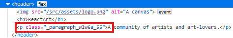
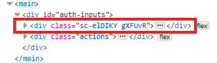

# Section 6: Styling React Components

### Vanilla CSS: 
- Advantages: CSS code is decoupled from JSX code
- Disadvatages: need to know CSS because code is not scoped to components, meaning CSS rules may clash across components. To clarify, even if we create a CSS file for an specific component, that CSS code will afect the entire project because every CSS file is injected globaly to the project. So if we set some style to a `

` all elements p will be affected. 

### Inline styles
Are styles that are set in the specific elemente, in place. In this format `

`
- Advantages: are quick and easy to add to JSX and the styles only affect the element to wich you add them. Dynamic and conditional styling is simple `style={{backgroundColor: emailNotValid ? '#fed2d2' : '#d1d5db'}}`
- Disadvantages: need to know CSS and is necessary to style every element individually, also there are no separation between CSS and JSX code.

### CSS Modules
Allows us to write Vanilla CSS code and rules that are then scoped. CSS Modules is an approach, that in the end needs to be implemented and enforced by the build process that's used in your React project. It's not a default browser or JavaScript feature. Instead, CSS Modules is an approach where the build tool will transform your CSS class names to be unique per file.
Naming pattern cosists in name the file as follows `Header.module.css`, this is like a signal for the underlying build process to convert or to add to the end some new value to make that class unique; also need to be imported this way `import classes from './Header.module.css'` 'classes' will be an object containing the class needed to be scope. `

`

;

### Styled Components
- Advantages: quick and easy to add, can continue "thinking in React", styles are scoped to components
- Disadvantages: need to know CSS, no clear separation of React & CSS code and end up with many relatively small "wrapper" components

The idea behind this popular package is not to define CSS rules and styles in separate CSS files, but also not as inline styles but instead in special components that are built 
with help of that package. `import { styled } from 'styled-components';`
**Styled** is a javascript object that allow us to access different properties with dot notation, like `styled.div`. This will create a div as a separete component but a component that will have any styles you want to applied to it.

~~~
const ControlContainer = styled.div` // this creates a div component with this styles
  display: flex;
  flex-direction: column;
  gap: 0.5rem;
  margin-bottom: 1.5rem;
`

<ControlContainer> // we use here the styled component
        

          <label>Email</label>
          <input
            type="email"
            className={emailNotValid ? 'invalid' : undefined}
            onChange={(event) => handleInputChange('email', event.target.value)}
          />
        

    </ControlContainer>
~~~

Styled components creates a unique classe
;

To render sytles dynamically as we are dealing with styled ***components*** we can and we should pass a prop to our styled component to use it on the creation of the styles. Like this:
~~~
const Label = styled.label`
  display: block;
  margin-bottom: 0.5rem;
  font-size: 0.75rem;
  font-weight: 700;
  letter-spacing: 0.1em;
  text-transform: uppercase;
  color: ${({$invalid}) => $invalid ? '#f87171' :  '#6b7280'};  // color is accepting the prop and using it to coditionally set a color
`

<Label $invalid={emailNotValid}>Email</Label> // we pass a bolean value to the prop invalid
~~~

To know, is a common convention to prefix the props of styled component not to crash with built-in component props. Like this `$invalid`

To apply styled to nested elements we just use '&' and media queries are used as in vanilla; for instance
~~~
const StyledHeader = styled.header` 
  display: flex;
  flex-direction: column;
  align-items: center;
  justify-content: center;
  margin-top: 2rem;
  margin-bottom: 2rem;

  & img { // this points to the img element inside header
    object-fit: contain;
    margin-bottom: 2rem;
    width: 11rem;
    height: 11rem;
  }

  @media (min-width: 768px) { 
    & { // this points to the element itself (header)
      margin-bottom: 4rem;
    }
  
    & h1 {
      font-size: 2.25rem;
    }
  }

const Button = styled.button`
  padding: 1rem 2rem;
  font-weight: 600;
  text-transform: uppercase;
  border-radius: 0.25rem;
  color: #1f2937;
  background-color: #f0b322;
  border-radius: 6px;
  border: none;
 
  & :hover { // pseudo selector are apply with the :
  background-color: #f0920e;
}
`
~~~

**Creating reusable components & components combinations**
When we deal with styled components of elements that we can reuse like a button, a paragraph, etc it is common to isolate the styled component in a separate file in order to import it in other files that can use those styles. 
For combinations of elemnts such as label and input also is a common practice to not only isolate it but also to export a function just as a component and use it like a whole component. For better understanding:
~~~
import styled from "styled-components";

const Label = styled.label` // styled label
  display: block;
  margin-bottom: 0.5rem;
  font-size: 0.75rem;
  font-weight: 700;
  letter-spacing: 0.1em;
  text-transform: uppercase;
  color: ${({$invalid}) => $invalid ? '#f87171' :  '#6b7280'};
`
const Input = styled.input` // styled input
  width: 100%;
  padding: 0.75rem 1rem;
  line-height: 1.5;
  background-color: ${({$invalid}) => $invalid ? '#fed2d2' : '#d1d5db'};
  color: ${({$invalid}) => $invalid ? '#ef4444' : '#374151'} ;
  border: 1px solid ${({$invalid}) => $invalid ? '#f73f3f' : 'transparent'};
  border-radius: 0.25rem;
  box-shadow: 0 1px 3px 0 rgba(0, 0, 0, 0.1), 0 1px 2px 0 rgba(0, 0, 0, 0.06);
`

export default function CustomInput({label, invalid, ...props}) { // export a custom styled component
    return (
        

            <Label $invalid={invalid}>{label}</Label>
            <Input $invalid={invalid} {...props} />
        

    )
}
~~~